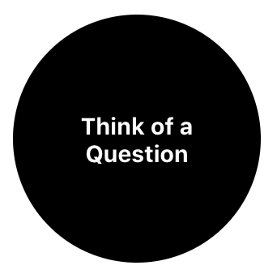

# React State - Eight Ball

## Solution Notes

Baseline environment was created using CRA.

    mkdir react_state
    cd react_state
    npx create-react-app eightball
    cd eightball
    npm install
    npm start

See CRA_README.md for more information on the environment created by CRA

Two components were created as described below in the Exercise instructions and requirements

    App.js
    Eightball.js, with Eightball.css

## Exercise Instructions and Requirements

(There is no starter code for this exercise)

In this exercise, you’ll build a simulation of a classic kid’s toy, the Magic Eight Ball.

This should appear as a black ball that initially reads “Think of a Question”, like this:



When you click on the ball, it should choose a random answer & the matching color for that answer. For example, after clicking, it might look like this:


### EightBall Component

This application will consist of two components:

App

    A simple component that just renders an EightBall component.

EightBall

    The component for the magic eight ball.

The EightBall should take a single property, answers, which should be an array of objects, with each object having a key for msg and color. For example, to use the answers from the classic commercial product, you could use these:

```
[
  { msg: "It is certain.", color: "green" },
  { msg: "It is decidedly so.", color: "green" },
  { msg: "Without a doubt.", color: "green" },
  { msg: "Yes - definitely.", color: "green" },
  { msg: "You may rely on it.", color: "green" },
  { msg: "As I see it, yes.", color: "green" },
  { msg: "Most likely.", color: "green" },
  { msg: "Outlook good.", color: "green" },
  { msg: "Yes.", color: "green" },
  { msg: "Signs point to yes.", color: "goldenrod" },
  { msg: "Reply hazy, try again.", color: "goldenrod" },
  { msg: "Ask again later.", color: "goldenrod" },
  { msg: "Better not tell you now.", color: "goldenrod" },
  { msg: "Cannot predict now.", color: "goldenrod" },
  { msg: "Concentrate and ask again.", color: "goldenrod" },
  { msg: "Don't count on it.", color: "red" },
  { msg: "My reply is no.", color: "red" },
  { msg: "My sources say no.", color: "red" },
  { msg: "Outlook not so good.", color: "red" },
  { msg: "Very doubtful.", color: "red" },
]
```

The EightBall will need state to keep track of the current color and message text, and this state should initially be “black” and “Think of a Question”.

Make it so that the ball chooses a random message when it is clicked on. This should change the background color of the ball and the message.
